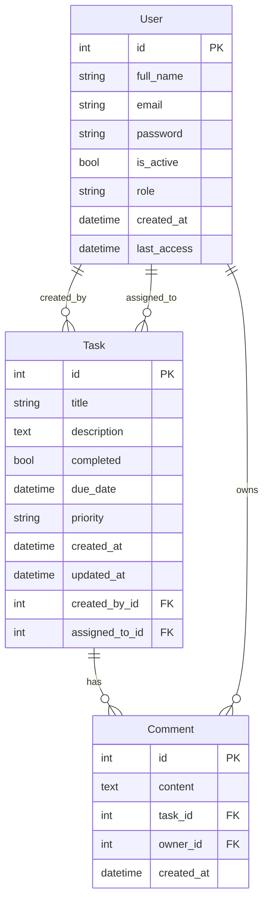

# Aplicación Full-Stack de Gestor de Tareas

Este repositorio contiene una aplicación full-stack de gestión de tareas, construida con un backend en FastAPI y un frontend en React.

## Resumen

Este proyecto es una solución completa de gestión de tareas, diseñada para ser ejecutada con Docker. Proporciona una robusta API de backend y una interfaz de usuario moderna y amigable.

- **Backend:** Una potente API RESTful construida con FastAPI, que proporciona endpoints para la gestión de tareas y usuarios.
- **Frontend:** Una interfaz de usuario responsive e interactiva construida con React y TypeScript.

Toda la aplicación está contenedorizada usando Docker, lo que permite una fácil configuración y despliegue.

## Estructura del Proyecto

Este repositorio es un monorepo que contiene los siguientes proyectos:

- `backend/`: La aplicación de backend en FastAPI. Para información más detallada, consulta el [backend/README.md](./backend/README.md).
- `frontend/`: La aplicación de frontend en React. Para información más detallada, consulta el [frontend/README.md](./frontend/README.md).

## Cómo Empezar

Toda la aplicación se puede ejecutar fácilmente usando Docker Compose.

### Prerrequisitos

- Docker
- Docker Compose

### Ejecutando la Aplicación

1.  **Clona el repositorio:**

    ```bash
    git clone https://github.com/iath-dev/task-manager-rpy.git
    cd task-manager
    ```

2.  **Variables de Entorno:**
    Crea un archivo `.env` en el directorio `backend`. Puedes copiar `backend/.env.example` a `backend/.env` y rellenar los valores requeridos.

3.  **Construye y ejecuta los servicios:**

    ```bash
    docker-compose up --build -d
    ```

4.  **Accede a la aplicación:**
    - **Frontend:** [http://localhost](http://localhost)
    - **Documentación de la API:** [http://localhost:8000/docs](http://localhost:8000/docs)

## Poblar la Base de Datos (Seeding)

Después de iniciar los servicios, la base de datos estará vacía. Para poblarla con datos iniciales (usuarios de prueba), puedes ejecutar el siguiente comando en tu terminal:

```bash
curl -X POST http://localhost:8000/api/v1/seed/
```

Esto creará un conjunto de usuarios con diferentes roles para que puedas probar la aplicación.

### Usuarios de Prueba

Una vez que la base de datos ha sido poblada, puedes usar los siguientes usuarios para iniciar sesión. La contraseña para todos es `123456`.

| Email               | Contraseña | Rol      |
| ------------------- | ---------- | -------- |
| `admin@example.com` | `123456`   | `ADMIN`  |
| `super@example.com` | `123456`   | `SUPER`  |
| `user@example.com`  | `123456`   | `COMMON` |

## Documentación de la API

La documentación de la API es generada automáticamente por FastAPI y se puede acceder en [http://localhost:8000/docs](http://localhost:8000/docs) cuando la aplicación está en ejecución.

## Esquema de la Base de Datos

Esta sección proporciona una visión general del esquema de la base de datos.



## Pruebas (Testing)

### Backend

Para ejecutar las pruebas del backend, usa el siguiente comando:

```bash
cd ./backend
```

```bash
poetry run pytest
```

### Frontend

Las pruebas del frontend están implementadas con Cypress. Para ejecutar las pruebas, usa el siguiente comando:

```bash
npm run cypress:open:component
```
