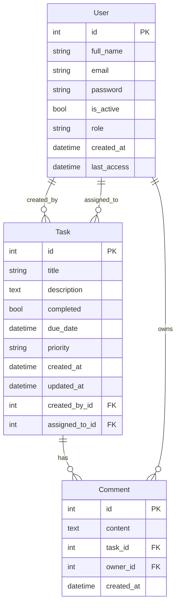

# Backend - API del Gestor de Tareas

Este es el backend para la aplicación de gestión de tareas, construido con FastAPI y Poetry.

## Tecnologías Utilizadas

*   **Framework:** FastAPI
*   **Lenguaje:** Python 3.11+
*   **Gestión de Dependencias:** Poetry
*   **Base de Datos:** PostgreSQL (implícito por `psycopg2-binary` y SQLAlchemy)
*   **ORM:** SQLAlchemy
*   **Migraciones:** Alembic
*   **Autenticación:** JWT (JSON Web Tokens) con `python-jose` y `passlib` (bcrypt)
*   **Configuración:** Pydantic Settings (`pydantic-settings`)
*   **Limitación de Tasa (Rate Limiting):** `slowapi`
*   **Logging:** Configuración de logging personalizada (`loguru`)
*   **Serialización/Validación:** Pydantic

## Estructura del Proyecto

```
backend/
├── alembic/
├── app/
│   ├── api/
│   ├── core/
│   ├── db/
│   ├── schemas/
│   └── services/
├── poetry.lock
├── pyproject.toml
└── README.md
```

## Endpoints de la API

La API proporciona endpoints RESTful para gestionar tareas y usuarios, con autenticación.

*   **Autenticación:**
    *   `POST /api/v1/auth/login`: Inicio de sesión de usuario.
    *   `POST /api/v1/auth/register`: Registro de usuario.
*   **Tareas:**
    *   `GET /api/v1/tasks`: Recupera una lista de tareas (con filtrado, ordenación, paginación).
    *   `POST /api/v1/tasks`: Crea una nueva tarea.
    *   `PUT /api/v1/tasks/{id}`: Actualiza una tarea existente.
    *   `DELETE /api/v1/tasks/{id}`: Elimina una tarea.
    *   `GET /api/v1/tasks/statistics`: Obtiene estadísticas de las tareas.
    *   `POST /api/v1/tasks/{id}/comments`: Añade un comentario a una tarea.
*   **Usuarios:**
    *   `GET /api/v1/users/me`: Obtiene los detalles del usuario actual.
    *   `GET /api/v1/users/{user_id}`: Obtiene un usuario por ID (solo administradores).
    *   `GET /api/v1/users/`: Lista todos los usuarios (solo administradores).

## Configuración y Ejecución

### Prerrequisitos

- Python 3.11+
- Poetry
- PostgreSQL
- Docker (para despliegue en contenedores)

### Desarrollo Local

1.  **Instalar dependencias:**

    ```bash
    poetry install
    ```

2.  **Crear un archivo `.env`:**

    Copia el archivo `.env.example` a `.env` y actualiza la URL de la base de datos y otras configuraciones.

3.  **Ejecutar el servidor de desarrollo:**

    ```bash
    poetry run uvicorn app.main:app --reload
    ```

### Migraciones de la Base de Datos

Alembic se utiliza para gestionar las migraciones de la base de datos.

-   **Crear una nueva migración:**

    ```bash
    poetry run alembic revision --autogenerate -m "Tu mensaje de migración"
    ```

-   **Aplicar migraciones:**

    ```bash
    poetry run alembic upgrade head
    ```

### Docker

Consulta el `README.md` raíz para obtener instrucciones sobre cómo ejecutar la aplicación con Docker Compose.

## Pruebas

Pytest se utiliza para las pruebas.

-   **Ejecutar todas las pruebas:**

    ```bash
    poetry run pytest
    ```

## Documentación de la API

La documentación de la API es generada automáticamente por FastAPI y está disponible en `/docs` y `/redoc` cuando el backend está en ejecución.

## Resumen del Esquema de la Base de Datos

Esta sección proporciona una visión general de alto nivel del esquema de la base de datos, detallando las tablas principales, sus columnas y relaciones.



### Detalles de las Tablas

A continuación se detallan las tablas:

#### Tabla de Usuarios (`users`)

Almacena la información de los usuarios.

| Nombre de Columna | Tipo      | Descripción                               | Restricciones           |
| :---------------- | :-------- | :---------------------------------------- | :---------------------- |
| `id`              | `Integer` | Identificador único para el usuario.      | Clave Primaria, Autoincremento |
| `full_name`       | `String`  | Nombre completo del usuario.              | Nulable                 |
| `email`           | `String`  | Dirección de correo electrónico del usuario.| Único, No Nulo          |
| `password`        | `String`  | Contraseña hasheada del usuario.          | No Nulo                 |
| `is_active`       | `Boolean` | Indica si la cuenta de usuario está activa.| Default: `True`, No Nulo|
| `role`            | `Enum`    | Rol del usuario (`ADMIN`, `SUPER`, `COMMON`).| Default: `COMMON`       |
| `created_at`      | `DateTime`| Fecha y hora de creación del usuario.     | Default: `utcnow`       |
| `last_access`     | `DateTime`| Fecha y hora del último acceso.           | Default: `utcnow`, On Update: `utcnow` |

#### Tabla de Tareas (`tasks`)

Almacena los detalles de las tareas.

| Nombre de Columna | Tipo      | Descripción                               | Restricciones           |
| :---------------- | :-------- | :---------------------------------------- | :---------------------- |
| `id`              | `Integer` | Identificador único para la tarea.        | Clave Primaria, Autoincremento |
| `title`           | `String`  | Título de la tarea.                       | No Nulo                 |
| `description`     | `Text`    | Descripción detallada de la tarea.        | Nulable                 |
| `completed`       | `Boolean` | Indica si la tarea está completada.       | Default: `False`        |
| `due_date`        | `DateTime`| Fecha límite para la tarea.               | Nulable                 |
| `priority`        | `Enum`    | Nivel de prioridad (`high`, `medium`, `low`).| Default: `medium`       |
| `created_at`      | `DateTime`| Fecha y hora de creación de la tarea.     | Default: `utcnow`       |
| `updated_at`      | `DateTime`| Fecha y hora de la última actualización.  | Default: `utcnow`, On Update: `utcnow` |
| `created_by_id`   | `Integer` | ID del usuario que creó la tarea.         | Clave Foránea (`users.id`), No Nulo |
| `assigned_to_id`  | `Integer` | ID del usuario al que se le asigna la tarea.| Clave Foránea (`users.id`), Nulable |

#### Tabla de Comentarios (`comments`)

Almacena los comentarios relacionados con las tareas.

| Nombre de Columna | Tipo      | Descripción                               | Restricciones           |
| :---------------- | :-------- | :---------------------------------------- | :---------------------- |
| `id`              | `Integer` | Identificador único para el comentario.   | Clave Primaria, Autoincremento |
| `content`         | `Text`    | Contenido del comentario.                 | No Nulo                 |
| `task_id`         | `Integer` | ID de la tarea a la que pertenece el comentario.| Clave Foránea (`tasks.id`) |
| `owner_id`        | `Integer` | ID del usuario que creó el comentario.    | Clave Foránea (`users.id`) |
| `created_at`      | `DateTime`| Fecha y hora de creación del comentario.  | Default: `utcnow`       |

### Relaciones

Esta sección describe las relaciones entre las tablas:

*   **Usuario a Tarea (Uno a Muchos):**
    *   Un `Usuario` puede crear muchas `Tareas` (`created_by_id`).
    *   A un `Usuario` se le pueden asignar muchas `Tareas` (`assigned_to_id`).
*   **Tarea a Comentario (Uno a Muchos):**
    *   Una `Tarea` puede tener muchos `Comentarios`.
*   **Usuario a Comentario (Uno a Muchos):**
    *   Un `Usuario` puede crear muchos `Comentarios` (`owner_id`).
